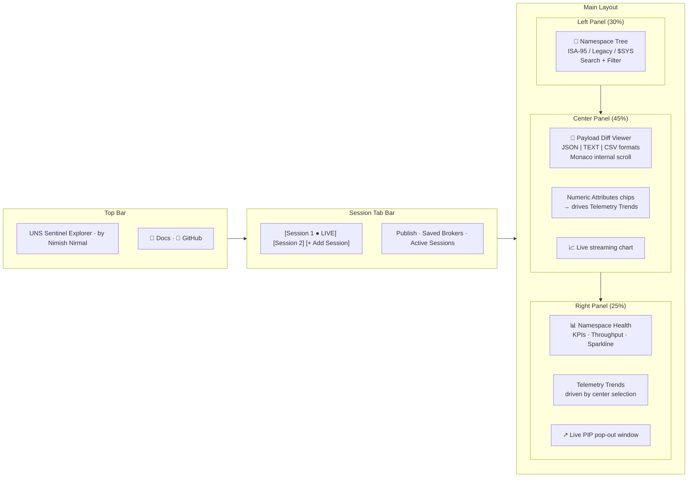
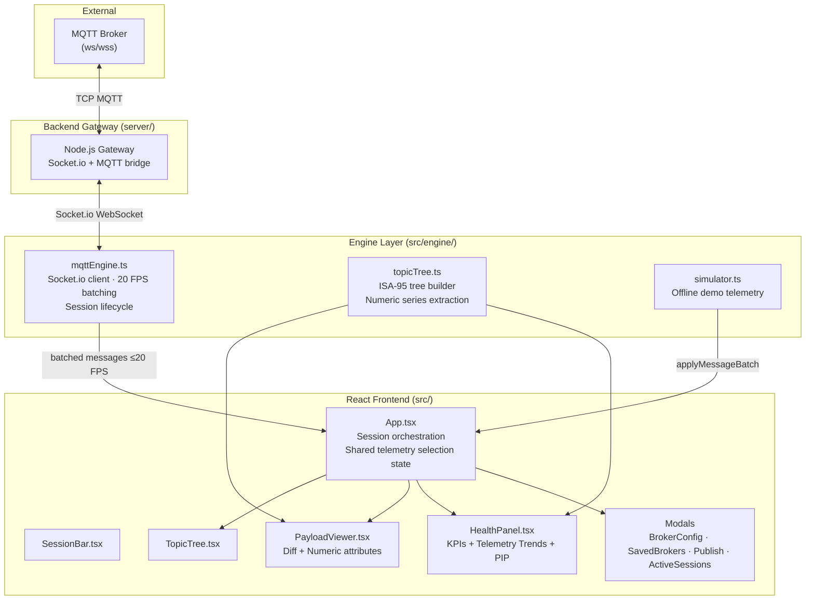
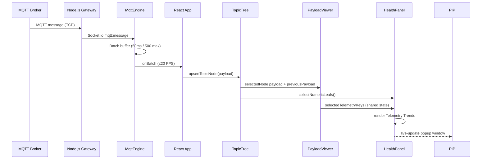

<p align="center">
  
</p>

<p align="center">
  <a href="https://nimish-nirmal.github.io/uns-sentinel-explorer/">
    
  </a>
  <a href="https://github.com/nimish-nirmal/uns-sentinel-explorer/actions/workflows/deploy-pages.yml">
    
  </a>
  <a href="https://github.com/nimish-nirmal/uns-sentinel-explorer/actions/workflows/ci.yml">
    
  </a>
  <a href="https://github.com/nimish-nirmal/uns-sentinel-explorer/blob/main/LICENSE">
    
  </a>
  <a href="https://www.typescriptlang.org/">
    
  </a>
  <a href="https://react.dev/">
    
  </a>
  <a href="https://vitejs.dev/">
    
  </a>
  <a href="https://tailwindcss.com/">
    
  </a>
  <a href="https://github.com/nimish-nirmal/uns-sentinel-explorer">
    
  </a>
  <a href="https://github.com/nimish-nirmal/uns-sentinel-explorer/issues">
    
  </a>
  <a href="https://github.com/nimish-nirmal/uns-sentinel-explorer/pulls">
    
  </a>
  
  
</p>

<h1 align="center">🔭 UNS Sentinel Explorer</h1>

<p align="center">
  <strong>UNS Sentinel Explorer is an open-source, web-based dashboard built for Unified Namespace architectures.</strong><br/>
  It features an ISA-95 hierarchical topic tree, multi-broker tab management, and dynamic auto-discovery for legacy topics.<br/>
  Effortlessly inspect real-time JSON payload diffs, plot live telemetry graphs, and publish custom MQTT data streams.
</p>

<p align="center">
  <strong>Created & maintained by <a href="https://github.com/nimish-nirmal">Nimish Nirmal</a></strong>
</p>

<p align="center">
  <a href="https://nimish-nirmal.github.io/uns-sentinel-explorer/" target="_blank" style="text-decoration: none;">
    
  </a>
</p>

> **💡 Note:** The Live Demo runs on **GitHub Pages (static hosting)** — it cannot run the Node.js backend gateway because GitHub Pages only serves static files (no server-side processes). The demo **automatically falls back to the built-in Demo Simulator**, so you can explore the full dashboard with realistic telemetry without any backend.
>
> To use **real MQTT broker connections**, run the app locally with `npm run dev:all` (starts both the frontend and the backend gateway).

---

## 📋 Table of Contents

- [✨ Features](#-features)
- [🚀 Quick Start](#-quick-start)
- [🎮 Live Demo](#-live-demo)
- [🔌 Connecting to a Broker](#-connecting-to-a-broker)
- [🖥️ User Interface](#️-user-interface)
- [🏗️ Architecture](#️-architecture)
- [⚙️ Configuration](#️-configuration)
- [🛠️ Tech Stack](#️-tech-stack)
- [📦 CI/CD & GitHub Pages](#-cicd--github-pages)
- [🤝 Contributing](#-contributing)
- [📄 License](#-license)

---

## ✨ Features

### 1. Multi-Broker Session Tabs 🔄
Manage multiple simultaneous MQTT broker connections, each in its own tab:

- **Live status indicator** — `● LIVE` pulse when connected
- **Protocol badge** — `WSS` (secure) or `WS` (plain)
- **Multi-topic subscription rules** — subscribe to wildcard patterns concurrently:
  ```
  Enterprise/Site1/Area1/Line1/Cell1/#
  legacy/sensors/+/temp
  $SYS/#
  ```
- Per-session stats isolated in the health panel

### 2. Dynamic Topic Tree Navigator (ISA-95 + Legacy) 🌳
Auto-builds a hierarchical tree by parsing topic strings on `/`:

| Node Type | Example | Color | Icon |
| --------- | ------- | ----- | ---- |
| **ISA-95** | `Enterprise/Site1/Area1/Line1/Cell1` | 🩵 Cyan | 🏢 |
| **Legacy** | `legacy/sensors/sensor-01/temp` | 🟢 Emerald | 📦 |
| **$SYS** | `$SYS/broker/uptime` | 🟡 Amber | ⚙️ |

- **Live search/filter** — instantly isolate matching topics by name, full path, or payload values
- Leaf timestamps show last update (`2s ago`)

### 3. Real-Time Payload Diff Viewer 📝
- **Monaco Diff Editor** highlights added/removed/changed keys between updates
- **View formats**: `JSON` | `TEXT` | `CSV` — switch between structured, flat key-value, or tabular views
- Custom dark theme with cyan/emerald token colors matching the dashboard
- **Internal scroll only** — long payloads scroll inside the editor while numeric attribute cards stay pinned

### 4. Numeric Attributes & Telemetry Trends 📈
- **Numeric attributes** are extracted from any payload — including values nested inside arrays/objects (e.g. `d[0].value`, `sensors[2].temp`)
- Click attribute chips in the center panel to **select what plots on Telemetry Trends**
- The right-panel **Telemetry Trends** chart is driven entirely by your center-panel selection
- Multiple attributes overlaid with distinct colors
- **Live PIP window** — pop out the chart to a standalone window that **updates in real-time** as data streams in

### 5. Namespace Health & Analytics 📊
- **Messages received** + total bytes
- **Throughput** (msg/sec) with live sparkline
- **Topic tree node** / payload counts
- **Active subscription rules** with QoS badges

### 6. MQTT Payload Publisher 📤
- Target topic path with autocomplete from tree
- JSON/Text payload editor
- **Retain checkbox — default ON for UNS**
- QoS selector (0, 1, 2)

### 7. Saved Brokers & Workspace 💾
- Persist profiles to `localStorage`
- One-click **Launch Session**, edit, or delete
- **Export / Import** all profiles as a JSON workspace file

### 8. Demo Simulator Mode 🧪
- Click **"Launch Demo Simulator"** — no broker needed
- Streams realistic ISA-95 + legacy telemetry entirely in-browser
- Perfect for offline UI testing / showcases

### 9. Secure Connection Form 🔐
- **Password eye toggle** — show/hide password with a click
- TLS/Certificate options for secure brokers (WSS/MQTTS)
- Protocol auto-port selection

---

## 🚀 Quick Start

### Prerequisites
- **Node.js ≥ 18** (tested on v20)
- npm or yarn

### Install & Run

```bash
# Clone the repo
git clone https://github.com/nimish-nirmal/uns-sentinel-explorer.git
cd uns-sentinel-explorer

# Install dependencies
npm install

# Start the dev server
npm run dev
# → http://localhost:5173/uns-sentinel-explorer/

# Production build
npm run build

# Preview the production build locally
npm run preview
```

### Using Node installed outside PATH (like this workspace)

```bash
export PATH="$HOME/.local/node/bin:$PATH"
npm install
npm run dev
```

---

## 🎮 Live Demo

Try it instantly on **GitHub Pages**:

<p align="center">
  <a href="https://nimish-nirmal.github.io/uns-sentinel-explorer/" target="_blank">
    
  </a>
</p>

> **💡 Tip:** Click **"Launch Demo Simulator"** in the header to see the full dashboard populated with realistic telemetry instantly.

---

## 🔌 Connecting to a Broker

Click **`+ Add Session`** in the top tab bar:

| Field            | Example                | Notes                          |
| ---------------- | ---------------------- | ------------------------------ |
| **Protocol**     | `WSS` (default) / `WS` | Auto-adjusts default port      |
| **Host**         | `broker.emqx.io`       | Public test broker             |
| **Port**         | `8084` (WSS) / `8083` (WS) | Auto-set by protocol      |
| **Session Label**| `My Factory UNS`       | Shown on the session tab       |
| **Client ID**    | *(auto-generated)*     | Optional — leave blank for random |
| **Username**     | *(optional)*           | For authenticated brokers      |
| **Password**     | *(optional, eye toggle)* | For authenticated brokers    |
| **Subscription Patterns** | One per line    | Wildcards supported (`#`, `+`) |
| **QoS**          | `0 / 1 / 2`            | Applied to all patterns        |
| **Save to local storage** | ✅ checked      | Persists profile for later     |

**Test brokers you can use:**

| Broker            | WSS Port | WS Port |
| ----------------- | -------- | ------- |
| `broker.emqx.io`  | 8084     | 8083    |
| `test.mosquitto.org` | 8081  | 8080    |
| `broker.hivemq.com`  | 8884  | 8000    |

---

## 🖥️ User Interface



---

## 🏗️ Architecture



### Data Flow



### Performance Buffering
Incoming MQTT packets are collected in an **in-memory batching array** and flushed to React state at **max 20 FPS** (50ms window). A batch cap of 500 messages protects memory on extreme loads — preventing UI freezes during high-rate bursts.

### Sparkplug B / Binary Handling
Payloads are decoded in order:
1. **JSON parse** — standard UTF-8 JSON payloads
2. **Printable string** — fallback for plain text
3. **Raw hex** — binary/protobuf (e.g. Sparkplug B) → `0x…`

---

## ⚙️ Configuration

### Vite (`vite.config.ts`)
- `base: '/uns-sentinel-explorer/'` — GitHub Pages subpath
- Code-split `manualChunks`: React, MQTT, Monaco, Recharts

### Tailwind (`tailwind.config.js`)
- Base: `slate-950` background
- Accents: cyan (`#22d3ee`), emerald (`#34d399`)

### Environment Variables
| Variable | Purpose |
| -------- | ------- |
| `VITE_GATEWAY_URL` | Backend gateway URL (defaults to `http://localhost:4000`) |

### localStorage Keys
| Key | Purpose |
| --- | ------- |
| `uns-sentinel-explorer:brokers` | Saved broker profiles |

---

## 🛠️ Tech Stack

| Layer      | Library                          | Version |
| ---------- | -------------------------------- | ------- |
| Framework  | React / Vite / TypeScript        | 18.3 / 5.4 / 5.6 |
| Styling    | Tailwind CSS                     | 3.4     |
| MQTT       | `mqtt` (WebSocket, v5 protocol)  | 5.10    |
| Diff Viewer| `@monaco-editor/react`           | 4.6     |
| Charts     | `recharts`                       | 2.15    |
| Icons      | `lucide-react`                   | 0.441   |

---

## 📦 CI/CD & GitHub Pages

Two workflows run automatically on every push to `main`:

### 1. CI (`ci.yml`)
Type-checks with `tsc --noEmit` and builds the production bundle. Badge:
[](https://github.com/nimish-nirmal/uns-sentinel-explorer/actions/workflows/ci.yml)

### 2. Deploy to GitHub Pages (`deploy-pages.yml`)
Builds and deploys the `dist/` directory to GitHub Pages. Requires Pages configured to **"GitHub Actions"** as the source in repo Settings → Pages. Badge:
[](https://github.com/nimish-nirmal/uns-sentinel-explorer/actions/workflows/deploy-pages.yml)

---

## 🤝 Contributing

Contributions are welcome! Here's how:

1. **Fork** the repository
2. **Create** a feature branch: `git checkout -b feat/amazing-feature`
3. **Commit** your changes: `git commit -m 'feat: add amazing feature'`
4. **Push** to the branch: `git push origin feat/amazing-feature`
5. Open a **Pull Request**

Please ensure your PR:
- ✅ Passes `npm run build` and `npx tsc --noEmit`
- ✅ Follows the existing code style
- ✅ Updates the README if adding features

---

## 📄 License

**MIT License** — see [LICENSE](LICENSE).

Copyright © 2026 [Nimish Nirmal](https://github.com/nimish-nirmal)

---

<p align="center">
  Made with ❤️ by <a href="https://github.com/nimish-nirmal">Nimish Nirmal</a> for the Unified Namespace community · ⭐ Star it if you find it useful!
</p>