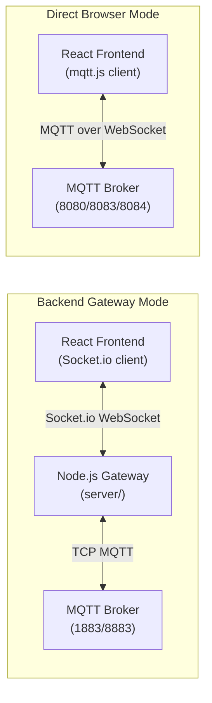
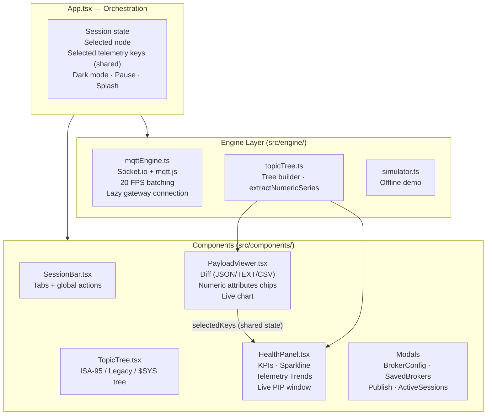
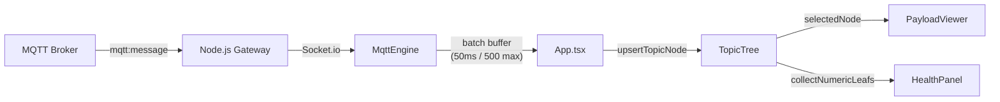
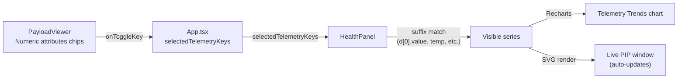
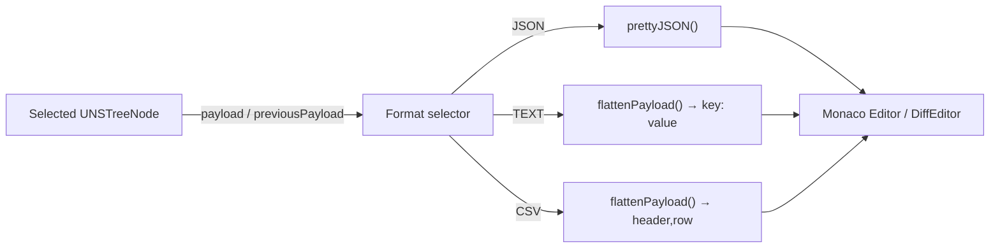
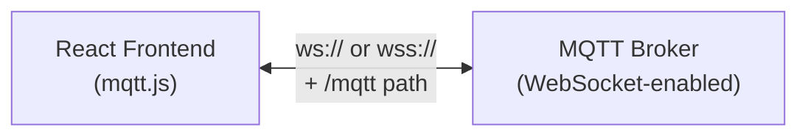

# UNS Sentinel Explorer — Architecture Guide

> **Created & maintained by [Nimish Nirmal](https://github.com/nimish-nirmal)**

---

## Overview

UNS Sentinel Explorer supports **two connection modes** so it works both as a full-stack app (with a Node.js gateway) and as a pure static site (direct browser WebSocket connections):

| Mode | Transport | Ports | Backend required? |
| ---- | --------- | ----- | ----------------- |
| **Backend Gateway** | Socket.io → TCP MQTT | 1883 / 8883 | ✅ Yes (`server/`) |
| **Direct Browser** | MQTT over WebSocket | 8080 / 8083 / 8084 / 443 | ❌ No |



---

## Why Two Modes?

### Browser Limitations
Browsers cannot make raw TCP connections (required for standard MQTT on ports 1883/8883). Browsers only support WebSocket connections. Therefore:

- **Direct Browser mode** MUST use WebSocket-enabled brokers (ws:// or wss://)
- **Backend Gateway mode** lets the Node.js server make the TCP connection on the browser's behalf, then forwards messages over Socket.io

### When to use each mode

| Use case | Recommended mode |
| -------- | ---------------- |
| Static hosting (GitHub Pages, Vercel) | **Direct Browser** |
| TCP-only brokers (port 1883/8883) | **Backend Gateway** |
| Self-signed TLS certificates | **Backend Gateway** |
| Credential security (hide passwords) | **Backend Gateway** |
| Quick demo / no backend | **Direct Browser** or **Demo Simulator** |
| Centralized logging / connection pooling | **Backend Gateway** |

---

## Frontend Architecture



### Key Data Flows

#### 1. Message Ingestion & Batching



In Direct Browser mode, the broker feeds directly into `MqttEngine` via `mqtt.js` (no gateway hop).

#### 2. Numeric Attribute Selection → Telemetry Trends



#### 3. Payload Diff Formats



---

## Backend Gateway (server/)

The Node.js gateway (`server/index.js`) provides:

1. **Protocol Translation** — Socket.io (browser) ↔ TCP MQTT (broker)
2. **Session Management** — centralized connection pooling and lifecycle
3. **Security** — credentials stay server-side; browser never sees passwords
4. **Port Auto-Conversion** — WebSocket ports from the frontend are converted to TCP ports:
   - `8080` / `8083` → `1883` (mqtt://)
   - `8084` / `443` → `8883` (mqtts://)
5. **Protocol Version Fallback** — defaults to MQTT 3.1.1 (v4); auto-retries with v3 if rejected; v5 only on explicit request
6. **Readable Errors** — converts raw MQTT errors (ECONNRESET, ETIMEDOUT, etc.) into human-readable messages

### Gateway Lifecycle

- The gateway **lazily connects** only when a gateway-mode session is started
- On static hosting with no backend, after 3 consecutive Socket.io failures, the app fires `onGatewayUnavailable` and auto-launches the Demo Simulator (only if gateway mode was used)
- Direct Browser sessions are unaffected by gateway availability

### REST API

| Endpoint | Method | Purpose |
| -------- | ------ | ------- |
| `/api/broker/connect` | POST | Connect to MQTT broker |
| `/api/broker/publish` | POST | Publish a message |
| `/api/broker/disconnect` | POST | Disconnect a session |
| `/api/broker/sessions` | GET | List active sessions |
| `/api/health` | GET | Health check |
| `/api/uns/attribution` | GET | Project attribution metadata |

### Socket.io Events

| Direction | Event | Payload |
| --------- | ----- | ------- |
| Client → Server | `broker:connect` | `{ host, port, protocol, topics, clientId, username, password, brokerId, ... }` |
| Client → Server | `broker:disconnect` | `{ sessionId }` |
| Client → Server | `broker:publish` | `{ sessionId, topic, payload, qos, retain }` |
| Server → Client | `mqtt:message` | `{ topic, payload, timestamp }` |
| Server → Client | `mqtt:connected` | `{ sessionId, host, port }` |
| Server → Client | `mqtt:disconnect` | `{ sessionId }` |
| Server → Client | `mqtt:error` | `{ sessionId, error }` |
| Server → Client | `mqtt:offline` | `{ sessionId }` |
| Server → Client | `mqtt:subscribe:error` | `{ sessionId, topic, error }` |

---

## Direct Browser Mode

Direct Browser mode uses `mqtt.js` (the same library as the backend) imported dynamically in the browser:



- Builds a WebSocket URL: `ws://host:port/mqtt` or `wss://host:port/mqtt`
- Auto-reconnect is **disabled** (`reconnectPeriod: 0`) to prevent connection thrashing; users reconnect manually via the UI
- Supports MQTT 3.1, 3.1.1, and 5.0 (including MQTT 5.0 properties)
- Credentials are visible in browser DevTools (inherent browser limitation)

---

## Comparison Matrix

| Feature | Backend Gateway | Direct Browser |
|---------|-----------------|----------------|
| **Architecture** | Frontend → Backend → Broker | Frontend → Broker |
| **Protocol** | Socket.io + TCP MQTT | MQTT over WebSocket |
| **TCP MQTT Support** | ✅ Yes (1883/8883) | ❌ No |
| **WebSocket MQTT** | ✅ Yes | ✅ Yes |
| **Secure WebSocket** | ✅ Yes | ✅ Yes |
| **Credential Security** | ✅ Hidden in backend | ⚠️ Visible in browser |
| **Connection Sharing** | ✅ Multiple tabs share | ❌ Each tab separate |
| **Offline Buffering** | ✅ Backend can queue | ❌ No buffering |
| **Debugging** | ✅ Centralized logs | ⚠️ Distributed |
| **Deployment** | ❌ Requires Node.js server | ✅ Pure frontend |
| **Latency** | ⚠️ Extra hop | ✅ Direct |
| **Scalability** | ✅ Backend manages pool | ❌ N connections for N tabs |
| **Auto-reconnect** | ✅ Backend handles | ❌ Disabled (manual) |
| **Static hosting** | ❌ No | ✅ Yes |

---

## Performance Buffering

Incoming MQTT packets are collected in an **in-memory batching array** and flushed to React state at **max 20 FPS** (50ms window). A batch cap of 500 messages protects memory on extreme loads — preventing UI freezes during high-rate bursts.

```
BATCH_WINDOW_MS = 50   // 20 FPS
BATCH_MAX_ITEMS = 500  // memory cap per flush
```

---

## Payload Decoding

Payloads are decoded in order:
1. **JSON parse** — standard UTF-8 JSON payloads (including bare numbers)
2. **Printable string** — fallback for plain text
3. **Raw hex** — binary/protobuf (e.g. Sparkplug B) → `0x…`

---

## Implementation Status

### ✅ Completed
- Backend gateway with comprehensive logging
- Frontend WebSocket connection via Socket.io (gateway mode)
- Direct Browser mode via mqtt.js (static hosting support)
- Lazy gateway connection (no errors on browser-only deployments)
- Gateway unavailable auto-fallback to Demo Simulator
- DOM warning fixed (password field now in form)
- Password eye toggle in connection form
- Anonymous toggle for open brokers
- Advanced MQTT settings (version, timeout, keep-alive, MQTT 5.0 properties)
- Payload diff formats (JSON / TEXT / CSV)
- Numeric attribute selection → Telemetry Trends
- Live PIP window (auto-updating SVG chart)
- Internal scroll for payload editor (numeric cards stay pinned)
- Infinite update loop fixed in PayloadViewer
- Telemetry chart glitching fixed (skip duplicate samples)
- Remove tags from Telemetry Trends
- Docs + GitHub links in top bar
- Gateway connection status indicator
- Active broker sessions in Saved Brokers list
- Light mode (full UI, not just 3 cards)
- Pause / Resume live stream
- Active Backend Sessions modal
- Splash screen & onboarding
- Default brokers use UNS topics (8 brokers: EMQX, Mosquitto, HiveMQ, Eclipse — TCP + WebSocket)
- Docker support (Dockerfile + docker-compose.yml)
- Protocol version fallback (3.1.1 → 3.1)
- Readable error messages
- Session cleanup on tab close
- Configurable gateway URL

### ⏭️ Future Considerations
- Sparkplug B protobuf decoding
- Topic tree export/import
- Historical telemetry persistence (beyond in-memory)
- Multi-user shared sessions

---

*Documentation maintained by [Nimish Nirmal](https://github.com/nimish-nirmal)*