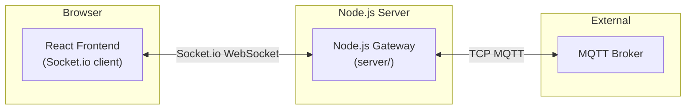
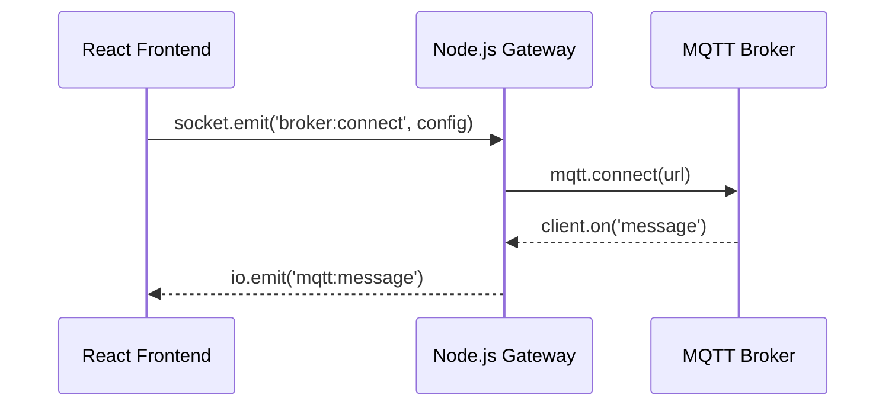
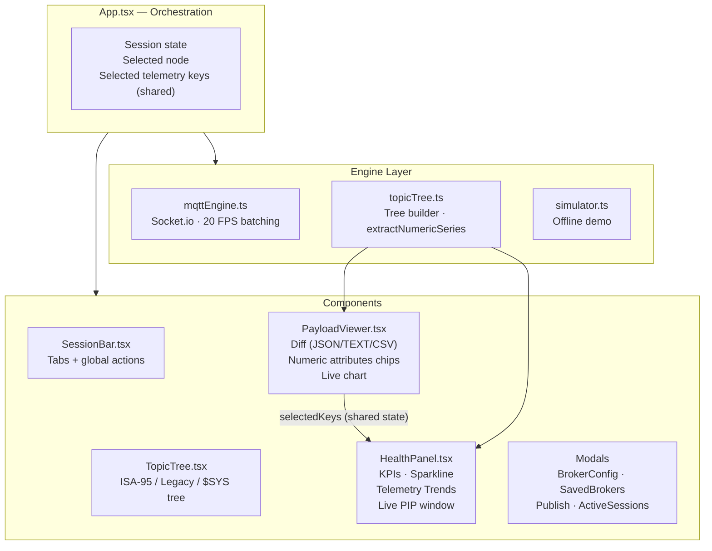
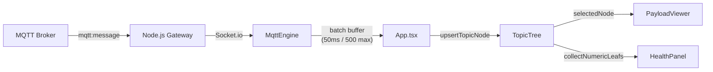
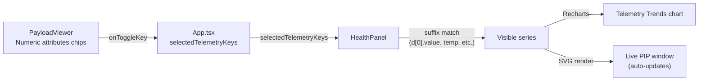
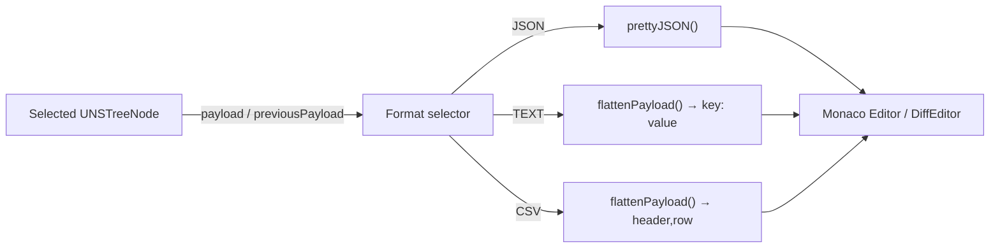
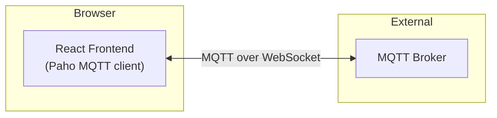

# UNS Sentinel Explorer — Architecture & Migration Guide

> **Created & maintained by [Nimish Nirmal](https://github.com/nimish-nirmal)**

---

## Current Architecture: Backend Gateway Pattern

### Why WebSocket?

**Browser Limitations:**
- Browsers cannot make raw TCP connections (required for standard MQTT on ports 1883/8883)
- Browsers only support WebSocket connections
- Therefore, all MQTT connections from browsers MUST use WebSocket (ws:// or wss://)

**Current Implementation:**



**Why a Backend Gateway?**
1. **Protocol Translation**: Converts WebSocket (from browser) ↔ TCP MQTT (to broker)
2. **Session Management**: Centralized connection pooling and lifecycle management
3. **Security**: Credentials never exposed to browser; backend handles authentication
4. **Reliability**: Auto-reconnection, message queuing, connection health monitoring
5. **Scalability**: Multiple browser tabs can share MQTT connections

### Current Data Flow



---

## Frontend Architecture



### Key Data Flows

#### 1. Message Ingestion & Batching



#### 2. Numeric Attribute Selection → Telemetry Trends



#### 3. Payload Diff Formats



---

## Alternative: Paho MQTT (Direct Browser Connection)

### What is Paho MQTT?

[Paho MQTT](https://www.npmjs.com/package/paho-mqtt) is an MQTT client library that runs **directly in the browser** using WebSocket connections. It eliminates the need for a backend gateway.

**Paho MQTT Architecture:**



### Paho MQTT Benefits

✅ **Simpler Architecture**: No backend gateway needed
✅ **Lower Latency**: Direct connection to broker
✅ **Reduced Server Load**: No Node.js gateway required
✅ **Easier Deployment**: Single frontend application
✅ **Standard Protocol**: Uses MQTT over WebSocket (ws://broker:8083/mqtt)

### Paho MQTT Limitations

❌ **Browser-Only**: Only works with WebSocket-enabled brokers
❌ **No TCP MQTT**: Cannot connect to standard ports (1883, 8883)
❌ **Credential Exposure**: Username/password visible in browser DevTools
❌ **No Centralized Logging**: Harder to debug across multiple clients
❌ **Connection Limits**: Each browser tab = separate MQTT connection
❌ **CORS Issues**: Broker must allow WebSocket connections from your domain

### Paho MQTT Implementation Example

```typescript
import Paho from 'paho-mqtt';

// Connect to broker
const client = new Paho.Client('broker.emqx.io', 8083, 'client-id');

client.connect({
  onSuccess: () => {
    console.log('Connected');
    client.subscribe('test/topic/#');
  },
  onFailure: (err) => {
    console.error('Connection failed:', err);
  }
});

// Receive messages
client.onMessageArrived = (message) => {
  console.log('Message:', message.destinationName, message.payloadString);
};

// Publish message
const msg = new Paho.Message('Hello World');
msg.destinationName = 'test/topic';
client.send(msg);
```

---

## Comparison Matrix

| Feature | Current (Gateway) | Paho MQTT (Direct) |
|---------|-------------------|-------------------|
| **Architecture** | Frontend → Backend → Broker | Frontend → Broker |
| **Protocol** | Socket.io + WebSocket | MQTT over WebSocket |
| **TCP MQTT Support** | ✅ Yes (via backend) | ❌ No |
| **WebSocket MQTT** | ✅ Yes | ✅ Yes |
| **Secure WebSocket** | ✅ Yes | ✅ Yes |
| **Credential Security** | ✅ Hidden in backend | ⚠️ Visible in browser |
| **Connection Sharing** | ✅ Multiple tabs share | ❌ Each tab separate |
| **Offline Buffering** | ✅ Backend can queue | ❌ No buffering |
| **Debugging** | ✅ Centralized logs | ⚠️ Distributed |
| **Deployment** | ❌ Requires Node.js server | ✅ Pure frontend |
| **Latency** | ⚠️ Extra hop | ✅ Direct |
| **Scalability** | ✅ Backend manages pool | ❌ N connections for N tabs |

---

## Recommendation

### Keep Current Architecture (Backend Gateway) If:
- ✅ You need to support standard MQTT (TCP) connections
- ✅ Security is critical (credentials must stay server-side)
- ✅ You want centralized logging and monitoring
- ✅ Multiple browser tabs need to share connections
- ✅ You need offline message buffering

### Migrate to Paho MQTT If:
- ✅ You only need WebSocket connections
- ✅ Simplicity is preferred over advanced features
- ✅ You want to eliminate the Node.js backend
- ✅ Credential security is not a concern
- ✅ Each tab can have its own connection

---

## Migration Path to Paho MQTT

If you want to migrate to Paho MQTT, here's the plan:

### Step 1: Install Paho MQTT
```bash
npm install paho-mqtt
```

### Step 2: Create Paho MQTT Engine
Create `src/engine/pahoMqttEngine.ts`:
```typescript
import Paho from 'paho-mqtt';

export class PahoMqttEngine {
  private clients = new Map<string, Paho.Client>();
  
  connect(config: BrokerConfig): void {
    const client = new Paho.Client(config.host, config.port, config.clientId);
    
    client.connect({
      userName: config.username,
      password: config.password,
      useSSL: config.protocol === 'wss' || config.protocol === 'mqtts',
      onSuccess: () => {
        // Subscribe to topics
        config.subscriptions.forEach(sub => {
          client.subscribe(sub.pattern);
        });
      }
    });
    
    client.onMessageArrived = (msg) => {
      // Handle message
    };
    
    this.clients.set(config.id, client);
  }
}
```

### Step 3: Update UI Components
- Replace Socket.io events with Paho callbacks
- Remove backend dependency
- Update connection status handling

### Step 4: Remove Backend
- Delete `server/` directory
- Remove Socket.io dependency
- Update package.json

---

## Current Implementation Status

### ✅ Completed
- Backend gateway with comprehensive logging
- Frontend WebSocket connection via Socket.io
- DOM warning fixed (password field now in form)
- Detailed connection debugging logs added
- Password eye toggle in connection form
- Payload diff formats (JSON / TEXT / CSV)
- Numeric attribute selection → Telemetry Trends
- Live PIP window (auto-updating SVG chart)
- Internal scroll for payload editor (numeric cards stay pinned)
- Infinite update loop fixed in PayloadViewer
- Docs + GitHub links in top bar

### 🔄 In Progress
- Testing MQTT connections with new logs
- Verifying message flow end-to-end

### ⏭️ Next Steps
1. Test connection with logs enabled
2. Verify message subscriptions work
3. Decide on Paho MQTT migration (if desired)
4. Implement chosen architecture

---

## Questions to Answer Before Migration

1. **Do you need TCP MQTT support?** (port 1883/8883)
   - If YES → Keep current architecture
   - If NO → Paho MQTT is viable

2. **Is credential security important?**
   - If YES → Keep current architecture
   - If NO → Paho MQTT is viable

3. **Do you need centralized logging?**
   - If YES → Keep current architecture
   - If NO → Paho MQTT is viable

4. **Do you want to eliminate the Node.js server?**
   - If YES → Migrate to Paho MQTT
   - If NO → Keep current architecture

---

## Conclusion

**Current architecture is recommended for production use** because:
- Better security (credentials never leave server)
- Supports all MQTT protocols (TCP + WebSocket)
- Centralized logging and monitoring
- Connection pooling and resource management
- Offline message buffering

**Paho MQTT is suitable for:**
- Quick prototypes
- Development/testing environments
- Applications where security is not critical
- Scenarios where deployment simplicity is paramount

The current implementation with enhanced logging will help you debug connection issues. Once you confirm MQTT is working, you can decide if migration to Paho MQTT is worth the tradeoffs.

---

*Documentation maintained by [Nimish Nirmal](https://github.com/nimish-nirmal)*