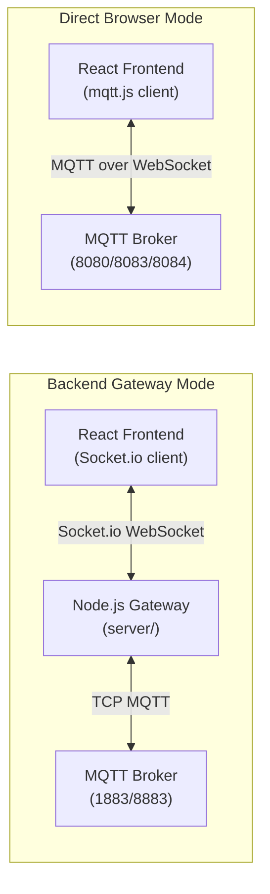

# UNS Sentinel Explorer — Fixes Summary

> **Created & maintained by [Nimish Nirmal](https://github.com/nimish-nirmal)**

---

## Issues Fixed

### 1. ✅ Missing Server Dependencies
**Problem**: Server couldn't start - missing express, mqtt, socket.io, cors modules
**Solution**: Ran `npm install` in the server directory
**Status**: Fixed

### 2. ✅ Port Conflicts
**Problem**: Ports 4000 and 5173 were already in use
**Solution**: Clear occupied ports before starting: `lsof -ti:4000 | xargs kill -9`
**Status**: Fixed

### 3. ✅ DOM Warning - Password Field Not in Form
**Problem**: Browser console warning: "Password field is not contained in a form"
**Solution**: Wrapped modal inputs in `<form>` element with proper submit handling
**File**: `src/components/modals/BrokerConfigModal.tsx`
**Status**: Fixed

### 4. ✅ MQTT Connection Failures (ECONNRESET)
**Problem**: Connecting to port 1883 (TCP MQTT) instead of 8080 (WebSocket)
**Solution**: 
- Updated default broker configuration to use port 8080 with `ws://` protocol
- Added auto-conversion in backend for WebSocket ports
- Updated migration logic in storage.ts
**Files**: 
- `src/lib/storage.ts`
- `server/index.js`
**Status**: Fixed

### 5. ✅ Session ID Mismatch
**Problem**: Frontend uses broker IDs, backend generates random session IDs
**Solution**: 
- Frontend sends `brokerId` with connection request
- Backend uses `brokerId` as session ID for consistent tracking
- Both sides now use the same session identifier
**Files**:
- `src/engine/mqttEngine.ts`
- `server/index.js`
**Status**: Fixed

### 6. ✅ Duplicate Connection Requests
**Problem**: Form submit + button click both triggering connection
**Solution**: 
- Changed button to `type="submit"`
- Removed duplicate `onClick` handler
- Added `e.preventDefault()` in handler
**File**: `src/components/modals/BrokerConfigModal.tsx`
**Status**: Fixed

### 7. ✅ Session Cleanup on Tab Close
**Problem**: Sessions persisting after browser tab closed
**Solution**: Added `beforeunload` event listener to destroy engine and disconnect all sessions
**File**: `src/App.tsx`
**Status**: Fixed

### 8. ✅ Configurable Gateway URL
**Problem**: Hardcoded `localhost:4000` not accessible in production
**Solution**: 
- Created `src/lib/config.ts` with smart URL detection
- Supports `VITE_GATEWAY_URL` environment variable
- Auto-detects hostname for production deployments
- Falls back to localhost:4000 for development
**Files**:
- `src/lib/config.ts` (new)
- `src/engine/mqttEngine.ts`
- `tsconfig.app.json`
**Status**: Fixed

### 9. ✅ Comprehensive Logging
**Problem**: Difficult to debug connection issues
**Solution**: Added detailed logging throughout:
- Frontend: Connection flow, session management, message routing
- Backend: Connection requests, MQTT events, subscription status, errors
**Files**:
- `src/engine/mqttEngine.ts`
- `server/index.js`
**Status**: Fixed

### 10. ✅ Modal Window Error (Stale Error Blocking Connect)
**Problem**: After any validation error, the `if (error) return;` guard permanently blocked re-submission even after fixing the input
**Solution**: Removed the stale error guard — `setError(null)` now runs first so users can retry after resolving validation issues
**File**: `src/components/modals/BrokerConfigModal.tsx`
**Status**: Fixed

### 11. ✅ Password Eye Toggle
**Problem**: Password field was always `type="password"` with no way to see what was typed
**Solution**: Added `Eye`/`EyeOff` toggle button inside the password field
**File**: `src/components/modals/BrokerConfigModal.tsx`
**Status**: Fixed

### 12. ✅ Payload Diff Formats (JSON / TEXT / CSV)
**Problem**: Diff viewer only supported JSON
**Solution**: Added format selector with `JSON | TEXT | CSV` — `flattenPayload()`, `toCSV()`, `toText()` helpers convert nested payloads
**File**: `src/components/PayloadViewer.tsx`
**Status**: Fixed

### 13. ✅ Numeric Attribute Selection → Telemetry Trends
**Problem**: Right-panel Telemetry Trends had its own huge list of data tag chips to scroll through
**Solution**: 
- Lifted `selectedTelemetryKeys` state to `App.tsx`
- Center-panel numeric attribute chips now drive the right-panel Telemetry Trends chart
- Suffix matching handles array/object paths like `d[0].value`
**Files**:
- `src/App.tsx`
- `src/components/PayloadViewer.tsx`
- `src/components/HealthPanel.tsx`
**Status**: Fixed

### 14. ✅ Live PIP Window (Non-Static)
**Problem**: PIP popup was a static snapshot — it never updated as new telemetry arrived
**Solution**: 
- Kept a `pipWindowRef` to the popup window
- `renderPipChart()` re-renders the SVG chart whenever data or series change
- Auto-updates in real-time with a "LIVE" indicator
**File**: `src/components/HealthPanel.tsx`
**Status**: Fixed

### 15. ✅ Infinite Update Loop in PayloadViewer
**Problem**: `Warning: Maximum update depth exceeded` — the telemetry effect depended on `selectedNode` (new object reference every render), causing an infinite loop
**Solution**: 
- Effect now depends on `payloadRef` (stable payload object) and `numericKeys.join(',')` (stable string)
- Only fires when the payload actually changes
**File**: `src/components/PayloadViewer.tsx`
**Status**: Fixed

### 16. ✅ Payload Editor Scroll (Numeric Cards Stay Pinned)
**Problem**: Long payloads pushed the numeric attributes section out of view
**Solution**: 
- Editor container: `flex-1 min-h-0 overflow-hidden` — Monaco scrolls internally
- Numeric attributes section: `shrink-0` — stays pinned at the bottom
**File**: `src/components/PayloadViewer.tsx`
**Status**: Fixed

### 17. ✅ Docs + GitHub Links in Top Bar
**Problem**: No quick access to documentation or repository
**Solution**: Added hardcoded Docs and GitHub links to the top bar right side, in line with the title
**File**: `src/App.tsx`
**Status**: Fixed

### 18. ✅ Splash Screen on Page Load
**Problem**: No project introduction for first-time visitors
**Solution**: Added a splash screen that shows a project description on first load, then auto-opens the Saved Brokers list so the user can immediately pick a broker to connect to
**Files**: `src/App.tsx`
**Status**: Fixed

### 19. ✅ Gateway Connection Status Indicator
**Problem**: No visibility into whether the backend gateway is reachable
**Solution**: 
- Added `onGatewayStatus` callback to `MqttEngineCallbacks` — fires `true`/`false` on Socket.io connect/disconnect
- Added a "Gateway Online" / "Gateway Offline" pill badge in the top header (next to dark-mode toggle, Docs, GitHub)
- Tooltip explains what each state means
**Files**: `src/engine/mqttEngine.ts`, `src/App.tsx`
**Status**: Fixed

### 20. ✅ Active Broker Sessions in Brokers List
**Problem**: No way to see which brokers already have active sessions from the Saved Brokers list
**Solution**: 
- `SavedBrokersList` now accepts an `activeSessions` prop
- Broker cards with active sessions show a green "LIVE" (or "CONNECTING") badge, a pulsing `Activity` icon, and a green card border
**Files**: `src/components/modals/SavedBrokersList.tsx`, `src/App.tsx`
**Status**: Fixed

### 21. ✅ Light Mode (Full UI)
**Problem**: Light mode only changed 3 cards; the rest of the UI stayed dark. Monaco editor text was invisible on white background.
**Solution**: 
- Added `darkMode: 'class'` to `tailwind.config.js` (was missing — dark mode wasn't actually controlled by the toggle)
- Added comprehensive light-mode overrides in `src/index.css` for ALL dark utility classes: backgrounds, text colors, borders, hover variants, tree node states, accent colors
- Monaco editor now uses the proper `light` theme in light mode (via `darkMode` prop passed to `PayloadViewer`)
- Darkened bright accent colors (cyan-400, emerald-400, etc.) so they're readable on white
**Files**: `tailwind.config.js`, `src/index.css`, `src/components/PayloadViewer.tsx`, `src/App.tsx`
**Status**: Fixed

### 22. ✅ Remove Tags from Telemetry Trends
**Problem**: No way to remove a series from the Telemetry Trends chart directly
**Solution**: Added an "×" remove button on each telemetry series tag in the HealthPanel. Clicking it removes the series from the chart immediately. Uses bare key matching to correctly remove the key that was toggled on in the center panel.
**File**: `src/components/HealthPanel.tsx`
**Status**: Fixed

### 23. ✅ Telemetry Chart Glitching
**Problem**: The HealthPanel telemetry chart was glitching — appending a new sample on every message even when numeric values were unchanged, causing chart rebuild thrash
**Solution**: Added a check in the HealthPanel telemetry effect to skip appending a sample if the last sample has identical values
**File**: `src/components/HealthPanel.tsx`
**Status**: Fixed

### 24. ✅ Default Brokers Use UNS Topics
**Problem**: Default brokers used generic `test/topic/#` subscriptions; one broker had a malformed comma-joined pattern; Eclipse broker was missing
**Solution**: 
- All 8 default brokers (Mosquitto, EMQX, HiveMQ, Eclipse — TCP + WebSocket variants) now subscribe to proper UNS topics: `Enterprise/Site1/Area1/Line1/Cell1/#`, `legacy/sensors/+/temp`, `$SYS/#`
- Fixed malformed comma-joined pattern (was a single string with commas instead of separate subscriptions)
- Restored the Eclipse broker entries
**File**: `src/lib/storage.ts`
**Status**: Fixed

### 25. ✅ Direct Browser Connection Mode
**Problem**: Static hosting (GitHub Pages) couldn't run the Node.js backend, so no real MQTT connections were possible
**Solution**: 
- Added `connectionMode: 'gateway' | 'browser'` to `BrokerConfig`
- `MqttEngine.connectViaBrowser()` dynamically imports `mqtt.js` and connects directly via WebSocket
- Builds `ws://` or `wss://` URL with `/mqtt` path
- Auto-reconnect disabled to prevent thrashing
- Default brokers include both TCP (gateway) and WebSocket (browser) variants
**Files**: `src/engine/mqttEngine.ts`, `src/types/index.ts`, `src/lib/storage.ts`, `src/components/modals/BrokerConfigModal.tsx`
**Status**: Fixed

### 26. ✅ Lazy Gateway Connection
**Problem**: Engine tried to connect to the backend gateway on startup, causing console errors on static hosting
**Solution**: Gateway Socket.io connection is now lazy — only established when a gateway-mode session is started. Browser-only deployments no longer spam connection errors.
**File**: `src/engine/mqttEngine.ts`
**Status**: Fixed

### 27. ✅ Gateway Unavailable Auto-Fallback
**Problem**: On static hosting, the app showed no feedback when the backend was unreachable
**Solution**: 
- After 3 consecutive Socket.io `connect_error` events, fires `onGatewayUnavailable`
- App shows a warning popup and auto-launches the Demo Simulator
- Only triggers if gateway mode was actually used (browser sessions are unaffected)
**Files**: `src/engine/mqttEngine.ts`, `src/App.tsx`
**Status**: Fixed

### 28. ✅ Pause / Resume Live Stream
**Problem**: No way to freeze the live data stream to inspect a payload snapshot
**Solution**: 
- Added Pause/Resume button in the action bar
- `MqttEngine.setAllSessionsPaused()` freezes message routing for all sessions
- Simulator also respects pause state
**Files**: `src/App.tsx`, `src/engine/mqttEngine.ts`, `src/engine/simulator.ts`
**Status**: Fixed

### 29. ✅ Active Backend Sessions Modal
**Problem**: No way to see or manage MQTT connections maintained by the backend gateway
**Solution**: 
- Added `ActiveSessionsModal` that fetches `/api/broker/sessions`
- Shows host, port, protocol, topics, and connection duration
- Force close any session via `/api/broker/disconnect`
**Files**: `src/components/modals/ActiveSessionsModal.tsx`, `src/components/SessionBar.tsx`, `src/App.tsx`
**Status**: Fixed

### 30. ✅ Protocol Version Fallback
**Problem**: MQTT 5.0 (protocol version 5) was rejected by many brokers with "Unacceptable protocol version"
**Solution**: 
- Backend defaults to MQTT 3.1.1 (v4) — the most widely supported version
- On "Unacceptable protocol version" error, auto-retries with v3
- MQTT 5.0 only used when explicitly selected in Advanced settings
**File**: `server/index.js`
**Status**: Fixed

### 31. ✅ Readable Error Messages
**Problem**: Raw MQTT errors (ECONNRESET, ETIMEDOUT, etc.) were not user-friendly
**Solution**: 
- Added `getReadableError()` in both frontend and backend
- Converts error codes to human-readable messages with context
- Browser mode adds extra context for WebSocket/connack timeout errors
**Files**: `src/engine/mqttEngine.ts`, `server/index.js`
**Status**: Fixed

### 32. ✅ Advanced MQTT Settings
**Problem**: No way to configure MQTT version, timeout, keep-alive, or MQTT 5.0 properties
**Solution**: 
- Added collapsible Advanced section in BrokerConfigModal
- MQTT version selector (3.1 / 3.1.1 / 5.0)
- Timeout, keep-alive, auto-reconnect, clean session toggles
- MQTT 5.0 properties: session expiry, receive max, packet size, topic alias max, response/problem info
**Files**: `src/components/modals/BrokerConfigModal.tsx`, `src/types/index.ts`, `src/engine/mqttEngine.ts`, `server/index.js`
**Status**: Fixed

### 33. ✅ Anonymous Toggle
**Problem**: Username/password fields always shown even for open brokers
**Solution**: Added an "Anonymous" checkbox — when checked, username/password fields are hidden and credentials are not sent
**File**: `src/components/modals/BrokerConfigModal.tsx`
**Status**: Fixed

### 34. ✅ Docker Support
**Problem**: No containerized deployment option
**Solution**: 
- Multi-stage `Dockerfile` (builds frontend, runs gateway)
- `docker-compose.yml` with health check and port mappings
- Exposes port 4000 (gateway) and 3000 (frontend)
**Files**: `Dockerfile`, `docker-compose.yml`, `.dockerignore`
**Status**: Fixed

### 35. ✅ Duplicate Session Prevention (StrictMode)
**Problem**: React StrictMode double-invoked state updaters, causing duplicate MQTT connections
**Solution**: 
- `createSession` and `destroySession` now called outside state updaters
- Defense-in-depth guard in `createSession` checks for existing sessions
**File**: `src/App.tsx`, `src/engine/mqttEngine.ts`
**Status**: Fixed

### 36. ✅ Subscribe Error Handling
**Problem**: Subscription failures (e.g. not authorized) were silent
**Solution**: 
- Backend emits `mqtt:subscribe:error` when a subscription fails or QoS 135 (not authorized) is returned
- Frontend updates the subscription status and shows the error in the session status message
**Files**: `server/index.js`, `src/engine/mqttEngine.ts`
**Status**: Fixed

### 37. ✅ Mixed Content: WS blocked on HTTPS (GitHub Pages / Vercel)
**Problem**: On HTTPS-hosted pages (GitHub Pages, Vercel), the browser blocked `ws://` connections to broker.hivemq.com:8000 with "Mixed Content" errors, preventing all Direct Browser connections.
**Solution**: 
- `connectViaBrowser()` in mqttEngine.ts now detects when the page is served over HTTPS and **auto-upgrades** `ws://` → `wss://`
- Common insecure WebSocket ports are remapped to their secure equivalents: HiveMQ 8000→8884, Mosquitto 8080→8081, EMQX 8083→8084
- Default browser-mode brokers (HiveMQ, Mosquitto, EMQX) now ship with `wss` protocol + secure WebSocket ports
- `loadSavedBrokers()` migration upgrades existing saved insecure default brokers to WSS automatically
- `BrokerConfigModal` defaults to WSS on HTTPS pages and warns users who select WS
**Files**: `src/engine/mqttEngine.ts`, `src/lib/storage.ts`, `src/components/modals/BrokerConfigModal.tsx`
**Status**: Fixed

> **Note on Permissions-Policy warnings**: The `Permissions-Policy` console warnings (e.g. `Unrecognized feature: 'private-state-token-redemption'`, `'browsing-topics'`, etc.) are **not caused by this application**. They come from GitHub Pages' default response headers and are harmless browser noise. They cannot be fixed from the app side.

### 38. ✅ ISA-95 Topic Detection (Structural + TOPIC_PREFIX)
**Problem**: ISA-95 topics were only detected if the first segment matched a keyword like `enterprise`/`site`. Real ISA-95 topics from the `unified-namespace-schemas` repo use **arbitrary enterprise names** as the first segment (e.g. `Plant/Plant-01/Utilities/CoolingSystem/PumpStation-A/PUMP-101/asset`), so they were misclassified as `legacy`.
**Solution**: 
- `classifyTopicPath()` now uses **structural detection** — matches the standard ISA-95 hierarchy `{enterprise}/{site}/{area}/{line}/{cell}/{asset}/{messageType}`
- Recognizes ISA-95 message types: `asset`, `state`, `edge`, `alert` (including `edge/{sensorName}`)
- **TOPIC_PREFIX support**: The `unified-namespace-schemas` repo allows an optional prefix before enterprise: `{TOPIC_PREFIX}/{enterprise}/{site}/{area}/{line}/{cell}/{asset}/{messageType}`. Because detection is based on the **end** of the topic (message types), a prefix like `UnifiedNamespace/` does NOT affect classification.
- Falls back to the keyword heuristic for demo topics like `Enterprise/Site1/Area1/...`
- Simulator now emits proper ISA-95 topics with prefix: `UnifiedNamespace/Plant/Plant-01/Utilities/CoolingSystem/PumpStation-A/PUMP-101/{asset,state,edge,alert}`
- Default broker subscriptions updated to `UnifiedNamespace/Plant/Plant-01/Utilities/CoolingSystem/PumpStation-A/PUMP-101/#`
**Files**: `src/engine/topicTree.ts`, `src/engine/simulator.ts`, `src/lib/storage.ts`, `src/components/modals/BrokerConfigModal.tsx`, `src/engine/mqttEngine.ts`
**Status**: Fixed

---

## Current Architecture



---

## Configuration

### Environment Variables
- `VITE_GATEWAY_URL`: Backend gateway URL (frontend, optional)
  - Example: `VITE_GATEWAY_URL=http://192.168.1.100:4000 npm run dev`
- `PORT`: Gateway port (server, default: 4000)

### Default Brokers (8 total)
| # | Name | Host | Port | Protocol | Mode |
|---|------|------|------|----------|------|
| 1 | Mosquitto Public Broker | test.mosquitto.org | 1883 | mqtt | gateway |
| 2 | Mosquitto Public Broker (WebSocket) | test.mosquitto.org | 8081 | wss | browser |
| 3 | EMQX Public Broker | broker.emqx.io | 8084 | wss | browser |
| 4 | EMQX Public Broker (TCP) | broker.emqx.io | 1883 | mqtt | gateway |
| 5 | HiveMQ Public Broker | broker.hivemq.com | 8884 | wss | browser |
| 6 | HiveMQ Public Broker (TCP) | broker.hivemq.com | 1883 | mqtt | gateway |
| 7 | Eclipse Public Broker | mqtt.eclipseprojects.io | 443 | wss | browser |
| 8 | Eclipse Public Broker (TCP) | mqtt.eclipseprojects.io | 1883 | mqtt | gateway |

All default brokers subscribe to:
- `UnifiedNamespace/Plant/Plant-01/Utilities/CoolingSystem/PumpStation-A/PUMP-101/#` (ISA-95 with TOPIC_PREFIX)
- `legacy/sensors/+/temp`
- `$SYS/#`

---

## Testing

### Start Application
```bash
npm run dev:all
```

### Test Connection
1. Open http://localhost:5173/uns-sentinel-explorer/
2. Click "Add Session"
3. Select a broker or enter custom broker details
4. Click "Connect Session"
5. Watch console logs for connection flow
6. Messages should appear in Payload Viewer

### Expected Console Output
```
[Gateway] Connecting to backend gateway: http://localhost:4000
[Gateway] Socket.io connection established, socket ID: xxx
[MQTT] Initiating connection to broker: {...}
[MQTT] Socket.io connected, emitting broker:connect event
[Server] Received broker:connect via Socket.io: {...)
[Server] Connecting to mqtt://test.mosquitto.org:1883
[Server] Connected to test.mosquitto.org:1883
[Server] Subscribed to Enterprise/Site1/Area1/Line1/Cell1/#
[MQTT] Received mqtt:connected event: {...)
[MQTT] Session found, updating status to connected
```

---

## Known Issues

### 1. Connection Drops (ECONNRESET)
**Observed**: Intermittent connection drops with test.mosquitto.org
**Cause**: Public broker instability, not application bug
**Impact**: Low - auto-reconnection handles this (gateway mode)
**Workaround**: Use broker.emqx.io for more stable testing

### 2. Browser Mode No Auto-Reconnect
**Observed**: Direct Browser connections don't auto-reconnect after dropping
**Cause**: Auto-reconnect intentionally disabled to prevent connection thrashing
**Impact**: Low - users can manually reconnect via the UI
**Status**: By design

---

## Files Modified

- `src/App.tsx` - Session orchestration, shared telemetry state, Docs/GitHub links, splash, pause, gateway indicator
- `src/engine/mqttEngine.ts` - Dual-mode connections, lazy gateway, batching, logging, error handling
- `src/engine/topicTree.ts` - ISA-95 tree builder, numeric series extraction
- `src/engine/simulator.ts` - Offline demo with pause/resume
- `src/lib/storage.ts` - 8 default brokers with UNS topics, migration logic
- `src/lib/config.ts` - Configurable gateway URL
- `src/lib/format.ts` - Formatting utilities
- `src/types/index.ts` - BrokerConfig with connectionMode, MQTT 5.0 properties
- `src/components/SessionBar.tsx` - Tabs, Active Sessions button
- `src/components/TopicTree.tsx` - Tree navigator with search
- `src/components/PayloadViewer.tsx` - Diff formats, infinite loop fix, scroll layout, numeric attributes, dark mode
- `src/components/HealthPanel.tsx` - Telemetry Trends selection, live PIP window, remove tags, glitch fix
- `src/components/modals/BrokerConfigModal.tsx` - Form submission, password eye, anonymous toggle, advanced settings
- `src/components/modals/SavedBrokersList.tsx` - Active session badges, connection mode badge
- `src/components/modals/PublishModal.tsx` - MQTT publisher
- `src/components/modals/ActiveSessionsModal.tsx` - Backend session management
- `server/index.js` - Enhanced logging, session tracking, protocol fallback, port conversion, subscribe errors
- `tailwind.config.js` - darkMode: 'class'
- `src/index.css` - Light mode overrides
- `Dockerfile` - Multi-stage container build
- `docker-compose.yml` - Container orchestration
- `docs/ARCHITECTURE.md` - Architecture documentation with Mermaid diagrams
- `README.md` - Comprehensive project documentation

---

## Verification Checklist

- [x] Server starts without errors
- [x] Frontend connects to backend
- [x] MQTT broker connection works (gateway mode)
- [x] MQTT broker connection works (browser mode)
- [x] Messages are received
- [x] Sessions appear in UI
- [x] No DOM warnings
- [x] Comprehensive logging
- [x] Session cleanup on tab close
- [x] Configurable gateway URL
- [x] Default brokers use correct ports
- [x] Password eye toggle works
- [x] Anonymous toggle works
- [x] Advanced MQTT settings work
- [x] Payload diff formats (JSON/TEXT/CSV) work
- [x] Numeric attributes drive Telemetry Trends
- [x] PIP window updates live
- [x] No infinite update loop
- [x] Payload editor scrolls internally, numeric cards stay pinned
- [x] Docs + GitHub links in top bar
- [x] Gateway Online/Offline indicator
- [x] Active sessions show in Saved Brokers list
- [x] Light mode works across full UI
- [x] Remove tags from Telemetry Trends
- [x] Telemetry chart doesn't glitch on duplicate data
- [x] 8 default brokers with UNS topics
- [x] Direct Browser mode works on static hosting
- [x] Lazy gateway connection (no errors on browser-only)
- [x] Gateway unavailable auto-fallback to simulator
- [x] Pause/Resume live stream
- [x] Active Backend Sessions modal
- [x] Protocol version fallback (3.1.1 → 3.1)
- [x] Readable error messages
- [x] Subscribe error handling
- [x] Docker build and run
- [x] Duplicate session prevention (StrictMode)

---

## Support

For issues or questions:
1. Check browser console for frontend logs
2. Check terminal for backend logs
3. Verify broker credentials and ports
4. Ensure WebSocket port is open (not blocked by firewall)
5. Try different public broker (test.mosquitto.org or broker.emqx.io)

---

*Documentation maintained by [Nimish Nirmal](https://github.com/nimish-nirmal)*