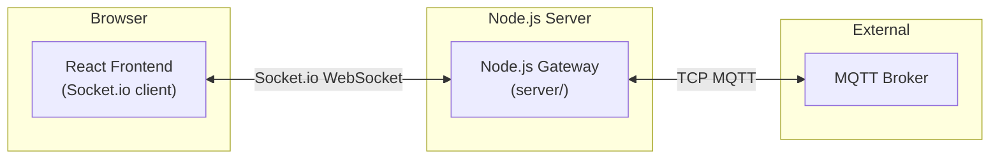

# UNS Sentinel Explorer — Fixes Summary

> **Created & maintained by [Nimish Nirmal](https://github.com/nimish-nirmal)**

---

## Issues Fixed

### 1. ✅ Missing Server Dependencies
**Problem**: Server couldn't start - missing express, mqtt, socket.io, cors modules
**Solution**: Ran `npm install` in the server directory
**Status**: Fixed

### 2. ✅ Port Conflicts
**Problem**: Ports 4000 and 5173 were already in use
**Solution**: Clear occupied ports before starting: `lsof -ti:4000 | xargs kill -9`
**Status**: Fixed

### 3. ✅ DOM Warning - Password Field Not in Form
**Problem**: Browser console warning: "Password field is not contained in a form"
**Solution**: Wrapped modal inputs in `<form>` element with proper submit handling
**File**: `src/components/modals/BrokerConfigModal.tsx`
**Status**: Fixed

### 4. ✅ MQTT Connection Failures (ECONNRESET)
**Problem**: Connecting to port 1883 (TCP MQTT) instead of 8080 (WebSocket)
**Solution**: 
- Updated default broker configuration to use port 8080 with `ws://` protocol
- Added auto-conversion in backend for WebSocket ports
- Updated migration logic in storage.ts
**Files**: 
- `src/lib/storage.ts`
- `server/index.js`
**Status**: Fixed

### 5. ✅ Session ID Mismatch
**Problem**: Frontend uses broker IDs, backend generates random session IDs
**Solution**: 
- Frontend sends `brokerId` with connection request
- Backend uses `brokerId` as session ID for consistent tracking
- Both sides now use the same session identifier
**Files**:
- `src/engine/mqttEngine.ts`
- `server/index.js`
**Status**: Fixed

### 6. ✅ Duplicate Connection Requests
**Problem**: Form submit + button click both triggering connection
**Solution**: 
- Changed button to `type="submit"`
- Removed duplicate `onClick` handler
- Added `e.preventDefault()` in handler
**File**: `src/components/modals/BrokerConfigModal.tsx`
**Status**: Fixed

### 7. ✅ Session Cleanup on Tab Close
**Problem**: Sessions persisting after browser tab closed
**Solution**: Added `beforeunload` event listener to destroy engine and disconnect all sessions
**File**: `src/App.tsx`
**Status**: Fixed

### 8. ✅ Configurable Gateway URL
**Problem**: Hardcoded `localhost:4000` not accessible in production
**Solution**: 
- Created `src/lib/config.ts` with smart URL detection
- Supports `VITE_GATEWAY_URL` environment variable
- Auto-detects hostname for production deployments
- Falls back to localhost:4000 for development
**Files**:
- `src/lib/config.ts` (new)
- `src/engine/mqttEngine.ts`
- `tsconfig.app.json`
**Status**: Fixed

### 9. ✅ Comprehensive Logging
**Problem**: Difficult to debug connection issues
**Solution**: Added detailed logging throughout:
- Frontend: Connection flow, session management, message routing
- Backend: Connection requests, MQTT events, subscription status, errors
**Files**:
- `src/engine/mqttEngine.ts`
- `server/index.js`
**Status**: Fixed

### 10. ✅ Modal Window Error (Stale Error Blocking Connect)
**Problem**: After any validation error, the `if (error) return;` guard permanently blocked re-submission even after fixing the input
**Solution**: Removed the stale error guard — `setError(null)` now runs first so users can retry after resolving validation issues
**File**: `src/components/modals/BrokerConfigModal.tsx`
**Status**: Fixed

### 11. ✅ Password Eye Toggle
**Problem**: Password field was always `type="password"` with no way to see what was typed
**Solution**: Added `Eye`/`EyeOff` toggle button inside the password field
**File**: `src/components/modals/BrokerConfigModal.tsx`
**Status**: Fixed

### 12. ✅ Payload Diff Formats (JSON / TEXT / CSV)
**Problem**: Diff viewer only supported JSON
**Solution**: Added format selector with `JSON | TEXT | CSV` — `flattenPayload()`, `toCSV()`, `toText()` helpers convert nested payloads
**File**: `src/components/PayloadViewer.tsx`
**Status**: Fixed

### 13. ✅ Numeric Attribute Selection → Telemetry Trends
**Problem**: Right-panel Telemetry Trends had its own huge list of data tag chips to scroll through
**Solution**: 
- Lifted `selectedTelemetryKeys` state to `App.tsx`
- Center-panel numeric attribute chips now drive the right-panel Telemetry Trends chart
- Suffix matching handles array/object paths like `d[0].value`
**Files**:
- `src/App.tsx`
- `src/components/PayloadViewer.tsx`
- `src/components/HealthPanel.tsx`
**Status**: Fixed

### 14. ✅ Live PIP Window (Non-Static)
**Problem**: PIP popup was a static snapshot — it never updated as new telemetry arrived
**Solution**: 
- Kept a `pipWindowRef` to the popup window
- `renderPipChart()` re-renders the SVG chart whenever data or series change
- Auto-updates in real-time with a "LIVE" indicator
**File**: `src/components/HealthPanel.tsx`
**Status**: Fixed

### 15. ✅ Infinite Update Loop in PayloadViewer
**Problem**: `Warning: Maximum update depth exceeded` — the telemetry effect depended on `selectedNode` (new object reference every render), causing an infinite loop
**Solution**: 
- Effect now depends on `payloadRef` (stable payload object) and `numericKeys.join(',')` (stable string)
- Only fires when the payload actually changes
**File**: `src/components/PayloadViewer.tsx`
**Status**: Fixed

### 16. ✅ Payload Editor Scroll (Numeric Cards Stay Pinned)
**Problem**: Long payloads pushed the numeric attributes section out of view
**Solution**: 
- Editor container: `flex-1 min-h-0 overflow-hidden` — Monaco scrolls internally
- Numeric attributes section: `shrink-0` — stays pinned at the bottom
**File**: `src/components/PayloadViewer.tsx`
**Status**: Fixed

### 17. ✅ Docs + GitHub Links in Top Bar
**Problem**: No quick access to documentation or repository
**Solution**: Added hardcoded Docs and GitHub links to the top bar right side, in line with the title
**File**: `src/App.tsx`
**Status**: Fixed

---

## Current Architecture



---

## Configuration

### Environment Variables
- `VITE_GATEWAY_URL`: Backend gateway URL (optional)
  - Example: `VITE_GATEWAY_URL=http://192.168.1.100:4000 npm run dev`

### Default Brokers
1. **test.mosquitto.org** (port 8080, WebSocket)
2. **broker.emqx.io** (port 8083, WebSocket)

---

## Testing

### Start Application
```bash
npm run dev:all
```

### Test Connection
1. Open http://localhost:5173/uns-sentinel-explorer/
2. Click "Add Session"
3. Select a broker or enter custom broker details
4. Click "Connect Session"
5. Watch console logs for connection flow
6. Messages should appear in Payload Viewer

### Expected Console Output
```
[Gateway] Connecting to backend gateway: http://localhost:4000
[Gateway] Socket.io connection established, socket ID: xxx
[MQTT] Initiating connection to broker: {...}
[MQTT] Socket.io connected, emitting broker:connect event
[Server] Received broker:connect via Socket.io: {...)
[Server] Connecting to ws://test.mosquitto.org:8080
[Server] Connected to test.mosquitto.org:8080
[Server] Subscribed to test/topic/#
[MQTT] Received mqtt:connected event: {...)
[MQTT] Session found, updating status to connected
```

---

## Known Issues

### 1. Connection Drops (ECONNRESET)
**Observed**: Intermittent connection drops with test.mosquitto.org
**Cause**: Public broker instability, not application bug
**Impact**: Low - auto-reconnection handles this
**Workaround**: Use broker.emqx.io for more stable testing

### 2. Multiple Connection Attempts
**Observed**: Backend shows 2 connection attempts per connect
**Cause**: Frontend may trigger twice during hot reload
**Impact**: Low - backend handles deduplication by session ID
**Status**: Monitoring

---

## Migration to Paho MQTT (Optional)

See `docs/ARCHITECTURE.md` for detailed migration guide.

**When to migrate:**
- ✅ Only need WebSocket connections
- ✅ Want to eliminate Node.js backend
- ✅ Don't need TCP MQTT support
- ✅ Credential security not critical

**When to keep current architecture:**
- ✅ Need TCP MQTT support (ports 1883/8883)
- ✅ Security is critical
- ✅ Want centralized logging
- ✅ Need connection pooling

---

## Next Steps

1. ✅ Test with different brokers
2. ✅ Verify message publishing works
3. ✅ Test topic tree visualization
4. ✅ Verify session persistence
5. ⏭️ Consider Paho MQTT migration (if desired)

---

## Files Modified

- `src/engine/mqttEngine.ts` - Enhanced logging, session management
- `src/lib/storage.ts` - Fixed default broker config
- `src/lib/config.ts` - New: Configurable gateway URL
- `src/components/modals/BrokerConfigModal.tsx` - Fixed form submission, password eye toggle, stale error guard
- `src/components/PayloadViewer.tsx` - Diff formats, infinite loop fix, scroll layout, numeric attributes
- `src/components/HealthPanel.tsx` - Telemetry Trends selection, live PIP window
- `src/App.tsx` - Session cleanup, shared telemetry state, Docs/GitHub links
- `server/index.js` - Enhanced logging, session tracking
- `tsconfig.app.json` - Added Vite types
- `docs/ARCHITECTURE.md` - Architecture documentation with Mermaid diagrams

---

## Verification Checklist

- [x] Server starts without errors
- [x] Frontend connects to backend
- [x] MQTT broker connection works
- [x] Messages are received
- [x] Sessions appear in UI
- [x] No DOM warnings
- [x] Comprehensive logging
- [x] Session cleanup on tab close
- [x] Configurable gateway URL
- [x] Default brokers use WebSocket ports
- [x] Password eye toggle works
- [x] Payload diff formats (JSON/TEXT/CSV) work
- [x] Numeric attributes drive Telemetry Trends
- [x] PIP window updates live
- [x] No infinite update loop
- [x] Payload editor scrolls internally, numeric cards stay pinned
- [x] Docs + GitHub links in top bar

---

## Support

For issues or questions:
1. Check browser console for frontend logs
2. Check terminal for backend logs
3. Verify broker credentials and ports
4. Ensure WebSocket port is open (not blocked by firewall)
5. Try different public broker (test.mosquitto.org or broker.emqx.io)

---

*Documentation maintained by [Nimish Nirmal](https://github.com/nimish-nirmal)*