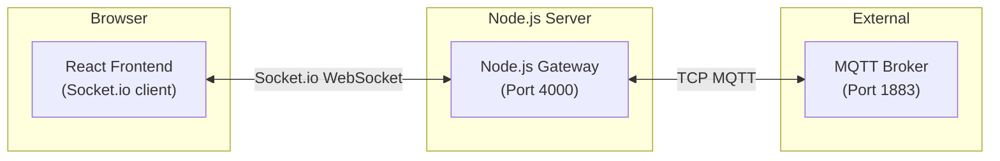

# UNS Sentinel Explorer — Node.js Backend Gateway

> **Created & maintained by [Nimish Nirmal](https://github.com/nimish-nirmal)**

Node.js TCP Gateway that handles raw MQTT broker connections and forwards messages to the React frontend via Socket.io.

## Architecture



## Features

- **Raw TCP MQTT Support**: Connects to MQTT brokers on port 1883 (TCP) or 8883 (TLS)
- **WebSocket API**: Real-time message forwarding to React frontend via Socket.io
- **REST API**: HTTP endpoints for connection management and publishing
- **Auto-reconnection**: Automatic reconnection to MQTT brokers
- **Multiple Sessions**: Support for multiple simultaneous broker connections
- **Topic Subscription**: Wildcard topic subscription support
- **Port Auto-Conversion**: Converts frontend WebSocket ports to TCP ports (8080/8083 → 1883, 8084/443 → 8883)
- **Protocol Version Fallback**: Defaults to MQTT 3.1.1 (v4); auto-retries with v3 if rejected; v5 on explicit request
- **Readable Errors**: Converts raw MQTT errors (ECONNRESET, ETIMEDOUT, etc.) into human-readable messages
- **Subscribe Error Handling**: Emits `mqtt:subscribe:error` when a subscription fails or QoS 135 (not authorized) is returned
- **Session Tracking**: Tracks sessions per Socket.io client; auto-cleans up on client disconnect
- **Attribution Endpoint**: Tamper-proof project metadata at `/api/uns/attribution`

## Installation

```bash
cd server
npm install
```

## Usage

### Start the server

```bash
# Production
npm start

# Development (with auto-reload)
npm run dev
```

The server will start on `http://localhost:4000`

### API Endpoints

#### POST /api/broker/connect
Connect to an MQTT broker

**Request Body:**
```json
{
  "host": "test.mosquitto.org",
  "port": 1883,
  "protocol": "mqtt",
  "topics": ["test/topic/#", "$SYS/#"],
  "clientId": "optional-client-id",
  "username": "optional-username",
  "password": "optional-password"
}
```

**Response:**
```json
{
  "success": true,
  "sessionId": "sess_abc123",
  "message": "Connected to test.mosquitto.org:1883"
}
```

#### POST /api/broker/publish
Publish a message to a topic

**Request Body:**
```json
{
  "sessionId": "sess_abc123",
  "topic": "test/topic",
  "payload": "Hello MQTT",
  "qos": 0,
  "retain": false
}
```

#### POST /api/broker/disconnect
Disconnect from a broker

**Request Body:**
```json
{
  "sessionId": "sess_abc123"
}
```

#### GET /api/broker/sessions
List all active sessions

**Response:**
```json
{
  "sessions": [
    {
      "id": "sess_abc123",
      "host": "test.mosquitto.org",
      "port": 1883,
      "protocol": "mqtt",
      "topics": ["test/topic/#"],
      "connectedAt": 1234567890
    }
  ]
}
```

#### GET /api/health
Health check endpoint

**Response:**
```json
{
  "status": "ok",
  "activeSessions": 1,
  "timestamp": 1234567890
}
```

#### GET /api/uns/attribution
Returns project attribution metadata (tamper-proof).

**Response:**
```json
{
  "project": "UNS Sentinel Explorer",
  "version": "1.0.0",
  "author": "Nimish Nirmal",
  "email": "nimish.nirmal@outlook.com",
  "github": "https://github.com/nimish-nirmal/uns-sentinel-explorer",
  "license": "MIT"
}
```

### WebSocket Events

#### Client → Server

- `broker:connect` - Connect to MQTT broker
- `broker:disconnect` - Disconnect from broker
- `broker:publish` - Publish message

#### Server → Client

- `mqtt:message` - Incoming MQTT message
  ```json
  {
    "topic": "test/topic",
    "payload": "Hello MQTT",
    "timestamp": 1234567890
  }
  ```
- `mqtt:connected` - Connection confirmed (`{ sessionId, host, port }`)
- `mqtt:disconnect` - Connection closed (`{ sessionId }`)
- `mqtt:error` - Error occurred (`{ sessionId, error }`)
- `mqtt:offline` - Broker offline (`{ sessionId }`)
- `mqtt:subscribe:error` - Subscription failed (`{ sessionId, topic, error }`)

## Configuration

Environment variables:

- `PORT` - Server port (default: 4000)

## Port Auto-Conversion

The frontend sends WebSocket ports (used by browsers), but the Node.js backend connects via TCP. The gateway automatically converts:

| Frontend Port | Backend Port | Protocol |
| ------------- | ------------ | -------- |
| 8080 | 1883 | `mqtt://` |
| 8083 | 1883 | `mqtt://` |
| 8084 | 8883 | `mqtts://` |
| 443 | 8883 | `mqtts://` |

## Protocol Version Fallback

The gateway defaults to **MQTT 3.1.1 (protocol version 4)** — the most widely supported version. If a broker rejects it with "Unacceptable protocol version", the gateway automatically retries with MQTT 3.1 (v3). MQTT 5.0 (v5) is only used when explicitly requested by the client in Advanced settings.

## Protocol Support

- `mqtt://` - MQTT over TCP (port 1883)
- `mqtts://` - MQTT over TLS (port 8883)
- `ws://` - MQTT over WebSocket (port 8080/8083) — converted to TCP by the gateway
- `wss://` - MQTT over Secure WebSocket (port 8084/443) — converted to TLS by the gateway

## Example Usage

```javascript
// Connect to test.mosquitto.org
const response = await fetch('http://localhost:4000/api/broker/connect', {
  method: 'POST',
  headers: { 'Content-Type': 'application/json' },
  body: JSON.stringify({
    host: 'test.mosquitto.org',
    port: 1883,
    protocol: 'mqtt',
    topics: ['test/topic/#', '$SYS/#']
  })
});

const { sessionId } = await response.json();

// Listen for messages via Socket.io
const socket = io('http://localhost:4000');
socket.on('mqtt:message', (data) => {
  console.log('Received:', data.topic, data.payload);
});

// Publish a message
await fetch('http://localhost:4000/api/broker/publish', {
  method: 'POST',
  headers: { 'Content-Type': 'application/json' },
  body: JSON.stringify({
    sessionId,
    topic: 'test/topic',
    payload: 'Hello World',
    qos: 0,
    retain: false
  })
});
```

## Stopping the Server

Press `Ctrl+C` to gracefully shutdown. All MQTT connections will be properly closed. The server also handles `SIGINT` to close all active sessions before exiting.

## Docker

The server is included in the project's multi-stage `Dockerfile`:

```bash
# From project root
docker compose up --build
# → Gateway: http://localhost:4000
# → Frontend: http://localhost:3000
```

Health check is configured on `/api/health` with a 30s interval.

---

*Documentation maintained by [Nimish Nirmal](https://github.com/nimish-nirmal)*
